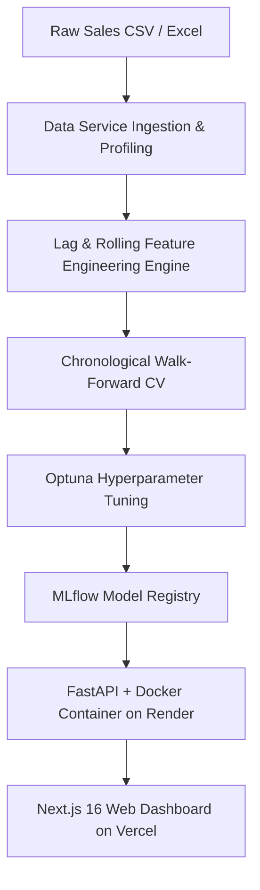

<div align="center">

# 📊 AI Demand Intelligence & Forecasting Platform

### Production-Grade Time-Series Demand Forecasting, Explainable AI (SHAP), MLOps Model Registry, Drift Monitoring, and Next.js Web Dashboard.

[](https://demand-ai.vercel.app)
[](https://demand-intelligence-api.onrender.com/docs)
[](https://www.python.org/)
[](https://nextjs.org/)
[](https://catboost.ai/)
[](https://mlflow.org/)

---

### 🌐 Live Production Endpoints

| Platform Component | Production URL | Description |
| :--- | :--- | :--- |
| **🎨 Web Dashboard** | **[https://demand-ai.vercel.app](https://demand-ai.vercel.app)** | Standalone Landing Page & Next.js 16 Forecast Studio Dashboard |
| **⚡ Backend API** | **[https://demand-intelligence-api.onrender.com](https://demand-intelligence-api.onrender.com)** | Containerized FastAPI RESTful Inference Server |
| **📖 Interactive API Docs** | **[https://demand-intelligence-api.onrender.com/docs](https://demand-intelligence-api.onrender.com/docs)** | OpenAPI / Swagger Endpoint Documentation |

</div>

---

## 🎯 Key Platform Features

- 🔮 **Multi-Horizon Forecasting Engine**: CatBoost, LightGBM, XGBoost, and Ridge models tuned independently per horizon (`1d`, `7d`, `14d`, `30d`) using chronological walk-forward cross-validation.
- 💡 **TreeSHAP Explainability**: Instant local feature attributions explaining positive demand drivers (+SHAP) vs. price/discount headwinds (-SHAP) for every prediction.
- 🛡️ **Data Ingestion & Schema Profiling**: Automated CSV/Excel validation, missing value imputation, and lag/rolling feature engineering with zero target leakage.
- 📉 **Model Health & Drift Detection**: PSI (Population Stability Index), Kolmogorov-Smirnov test, prediction drift tracking, and residual forecast bias alerts (`HEALTHY`, `WARNING`, `CRITICAL`).
- 🏆 **MLflow Model Registry**: Production model alias management (`models:/demand-catboost-h{h}@production`) with automated candidate model selection and manifest exports.
- 💬 **AI Analyst Interface (Phase 8 Preview)**: Business-focused natural language interface translating complex predictions into audited risk decisions.

---

## 🏗️ Architecture Topology



---

## 🚀 Next.js Web Dashboard Pages

| Route | Page | Purpose & Visual Features |
| :--- | :--- | :--- |
| **`/`** | **Landing Page** | Vesper-inspired single-viewport hero with Instrument Serif headline, liquid-metal pills, liquid-glass buttons, CloudFront video background, and 13 platform content sections. |
| **`/dashboard`** | **Executive Overview** | Key business metric cards (Demand 125.4K, WAPE 11.27%, 42 Stores, 318 Products), macro trend chart, growth rankings, and inventory risk alerts. |
| **`/datasets`** | **Dataset Management** | Drag-and-drop CSV/Excel file upload zone, 1-click `sample_data.csv` download, progress bar, required/optional column guide, and summary stats. |
| **`/data-quality`** | **Data Quality Health** | Data health gauge (**98.8%**), missing value breakdown table per column, and schema integrity audit alerts. |
| **`/eda`** | **EDA Analytics** | Macro demand trajectory with Daily/Weekly/Monthly toggles, day-of-week seasonality (Peak: Saturday, Lowest: Monday), and store/product performance rankings. |
| **`/forecast`** | **Forecast Studio** | 3-step forecast wizard (Upload ➔ Select Store/Product/Horizon ➔ Expected Demand & SHAP breakdown). **Zero manual ML feature entry required.** |
| **`/explainability`** | **SHAP Drivers** | TreeSHAP feature attributions breakdown (+SHAP Drivers vs -SHAP Headwinds) with natural language business summaries. |
| **`/performance`** | **Model Leaderboard** | Walk-forward CV vs test WAPE comparisons across horizons (`1d`, `7d`, `14d`, `30d`) with candidate model selection tags (*Optuna-tuned* vs *Phase 3 Baseline*). |
| **`/monitoring`** | **Model Health & Drift** | Feature Population Stability Index (PSI), Kolmogorov-Smirnov test, residual forecast bias, and tracking signal. |
| **`/analyst`** | **AI Demand Analyst** | Natural language analytics interface preview with prompt suggestions and audited tool execution sources. |
| **`/settings`** | **System Settings** | Public API base URL configuration, MLflow tracking URI (`file:///app/mlruns`), CatBoost metadata, and environment details. |

---

## ⚡ API Endpoints Summary

```text
GET  /ready                 - AdBlocker-safe readiness check & model connectivity
GET  /health                - System health check
POST /forecast              - Single-point multi-horizon demand prediction
POST /batch_predict         - Multi-record demand predictions
POST /explain               - SHAP feature attributions & driver breakdown
GET  /metrics               - Phase 5 model leaderboard metrics
GET  /drift                 - Feature PSI, KS test, and residual drift report
POST /data/upload           - Multipart CSV/Excel dataset upload & profiling
GET  /data/summary          - Active dataset summary profiling statistics
GET  /data/lookup-features  - Auto-retrieval of derived lag & rolling features per series
```

---

## 💻 Local Development Setup

### 1. Prerequisites
- Python 3.11+
- Node.js 18+ & `npm`
- Git

### 2. Backend Setup
```bash
# Clone the repository
git clone https://github.com/VedantJadhav701/ai-demand-intelligence-platform.git
cd ai-demand-intelligence-platform

# Create & activate environment
conda create -n demand_env python=3.11 -y
conda activate demand_env

# Install dependencies
pip install -r requirements.txt

# Run pytest suite (71 passing tests)
pytest -v

# Run FastAPI backend server
python -m api.main
```

### 3. Frontend Setup
```bash
# Navigate to frontend directory
cd frontend

# Install Node dependencies
npm install

# Build Next.js application
npm run build

# Start Next.js development server
npm run dev
```

---

## 📁 Repository Structure

```text
ai-demand-intelligence-platform/
├── api/                        # FastAPI Router & Endpoint Definitions
│   ├── routes/                 # Data, Forecast, Explain, Metrics, Model, Health routes
│   ├── main.py                 # FastAPI Application Entry & CORS Setup
│   └── schemas.py              # Pydantic Request & Response Schemas
├── frontend/                   # Next.js 16 TypeScript & Tailwind CSS Application
│   ├── src/app/                # App Router Pages (12 Routes)
│   ├── src/components/         # Layout Components (Sidebar, Topbar)
│   └── src/lib/api.ts          # Centralized Frontend API Client
├── src/                        # Core ML Infrastructure
│   ├── data/                   # Data Ingestion & Schema Profiling
│   ├── eda/                    # Exploratory Data Analysis & Visualization
│   ├── evaluation/             # Walk-Forward Cross-Validation Splitter
│   ├── explainability/         # TreeSHAP Explainer Engine
│   ├── features/               # Lag, Rolling & Temporal Feature Builder
│   ├── models/                 # CatBoost, LightGBM, XGBoost, Ridge Forecasters
│   ├── monitoring/             # PSI & KS Feature Drift Detector
│   ├── optimization/           # Optuna Hyperparameter Tuner
│   └── services/               # Data, Model, Forecast & Monitoring Services
├── configs/                    # YAML Configuration Files
├── Dockerfile                  # Container Production Build Specification
├── pyproject.toml              # Python Project Dependencies & Tooling
└── requirements.txt            # Python Package Dependencies
```

---

## 📄 License & Attribution

Developed as a production-grade AI Demand Intelligence and Forecasting Platform.  
© 2026 AI Demand Intelligence. All rights reserved.
